<h1 align="center">UniMate</h1>

<p align="center">
  <strong>Your academic life, organized in one place.</strong><br/>
  A web app that helps university students manage courses, deadlines, study
  resources, grades — and talk to their classmates.
</p>

<p align="center">
  
  
  
  
</p>

<p align="center">
  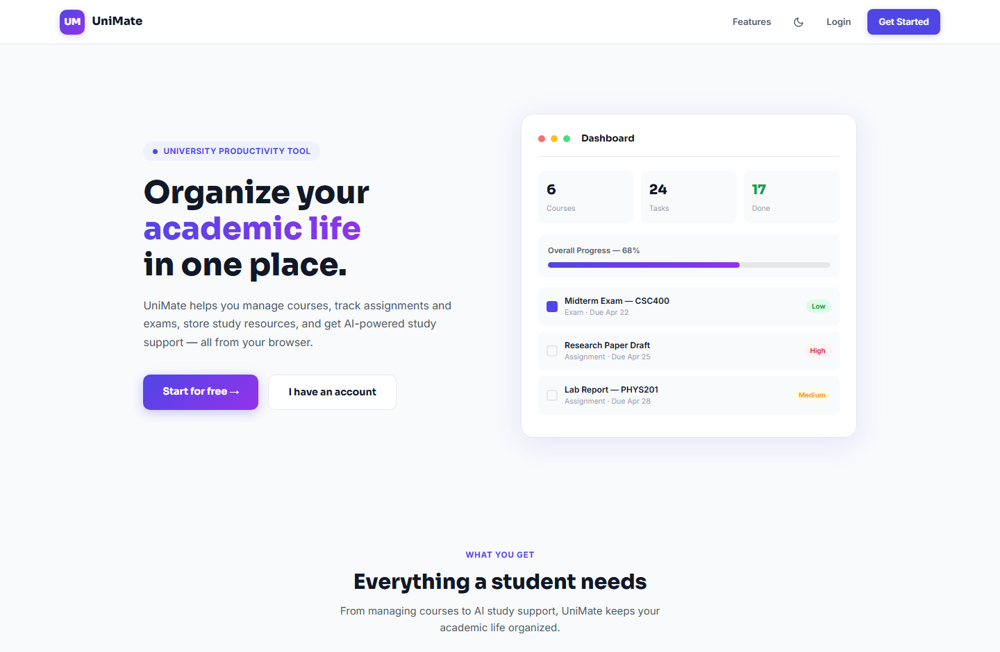
</p>

---

## About

**UniMate** was built for **CSC 400 – Web Programming** at **Al Maaref University**.

Students juggle courses, assignments, exams, notes, and group work across a
dozen different apps. UniMate puts all of it behind one login: a dashboard that
tells you what's due, a calendar of your semester, a place to keep your notes
and files, a GPA tracker, a study assistant, and a chat that automatically
connects you with the people sitting in the same lectures.

The backend is a **Laravel 12 JSON API** secured with **Sanctum** tokens.
The frontend is deliberately **plain HTML, CSS, and JavaScript** — no framework,
no build step — to keep the course's frontend fundamentals visible in the code.

---

## Table of contents

- [Features](#features)
- [Screenshots](#screenshots)
- [Tech stack](#tech-stack)
- [Getting started](#getting-started)
- [Optional: demo data](#optional-demo-data)
- [Optional: connect a real AI model](#optional-connect-a-real-ai-model)
- [Project structure](#project-structure)
- [API reference](#api-reference)
- [Database schema](#database-schema)
- [Deployment](#deployment)

---

## Features

### 📊 Dashboard
Greets you by name and answers "what do I need to worry about today?" —
five live counters, an overall progress bar, and your five nearest deadlines
labelled *overdue*, *due today*, or *due in N days*. Optional browser
notifications summarise what's due each day.

### 📚 Course management
Add every course with its code, instructor, and semester. Optionally record
**credits and a letter grade** to feed the GPA calculator. Search, filter by
semester, and sort by name, code, or instructor. Each course opens a detail
view with its own tasks and resources.

### ✅ Tasks & exams
Track assignments, exams, and projects with due dates, priorities, and
completion state — in a **list view** or a **monthly calendar**. Filter by
status, type, priority, and course; sort by date, priority, or title.
Every task can carry a **file attachment**.

### 🗂️ Study resources — private or shared
Store notes, links, and uploaded files per course. Tick **"share with
classmates"** and your resource becomes visible to everyone at your university
taking the same course code, credited to you.

### 💬 Messaging
Two ways to reach the people in your classes:

- **Course groups** — every course code is automatically a chat room shared
  with all students at your university taking it. No invites, no setup.
- **Direct messages** — one-to-one with any classmate who shares a course
  with you.

Both show unread badges and refresh automatically.

### 🤖 AI study assistant
Ask about your own deadlines — *"what's due this week?"*, *"any overdue
tasks?"*, *"what should I do next?"* — and get answers grounded in your real
data. Attach a text file for the assistant to read. Conversations can be saved
and reloaded. Works offline out of the box; connect an API key for a real model.

### 📈 Statistics & GPA
Completion percentages overall, by task type, and per course, plus a
**weighted GPA** calculated from your course grades and credits.

### 👤 Profile
Upload a **profile picture**, edit your details, and change your password.
Your picture appears in the sidebar and next to your messages.

### 🎨 Design
A responsive interface with **light and dark themes**, built mobile-first with
a slide-in sidebar, wrapping toolbars, and touch-friendly targets.

---

## Screenshots

### Dashboard
> Deadlines, progress, and counters at a glance.

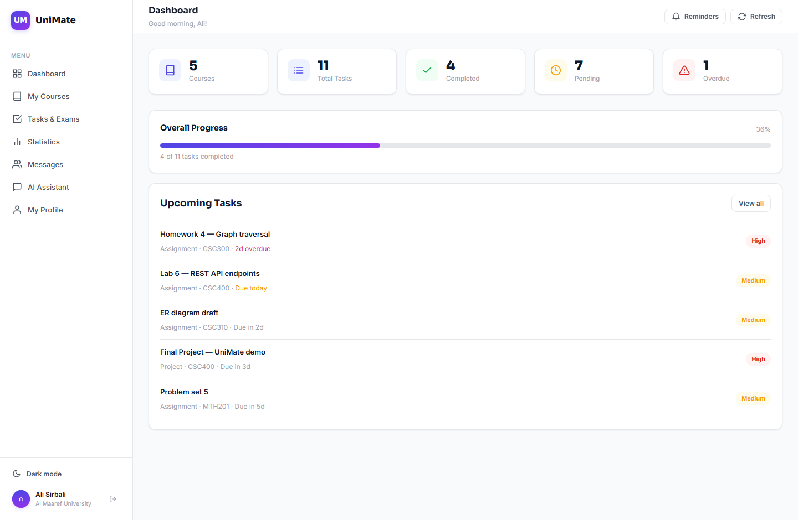

### My courses
> Every course with pending-task counts and grade badges.

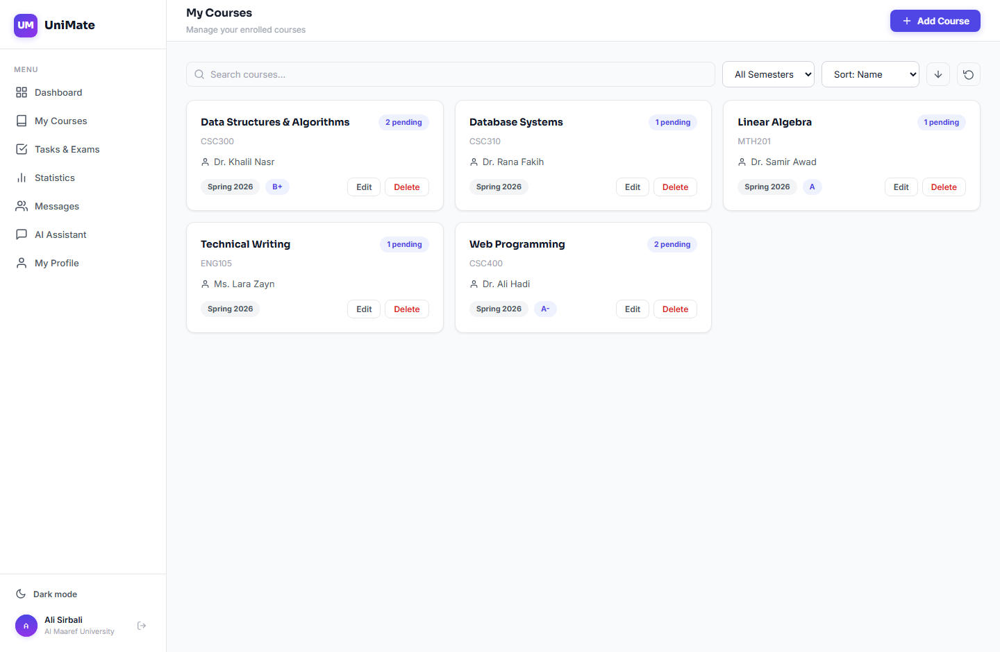

### Tasks — list and calendar
> The same tasks, two ways to look at them. Calendar chips are colour-coded by
> priority, and today is outlined.

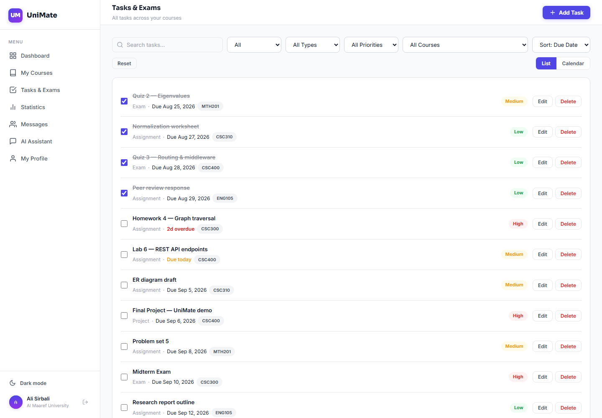
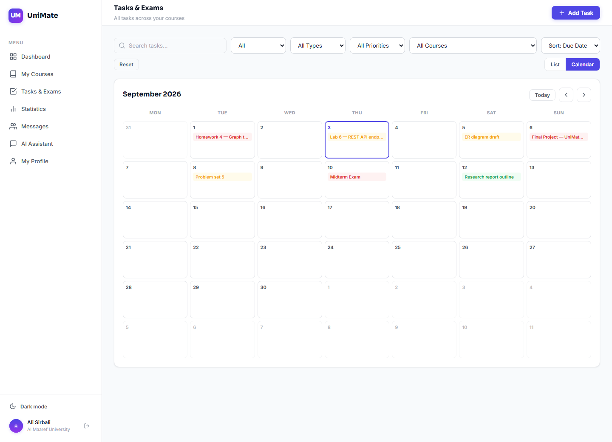

### Course group chat
> One room per course code, with classmates listed underneath for direct messages.

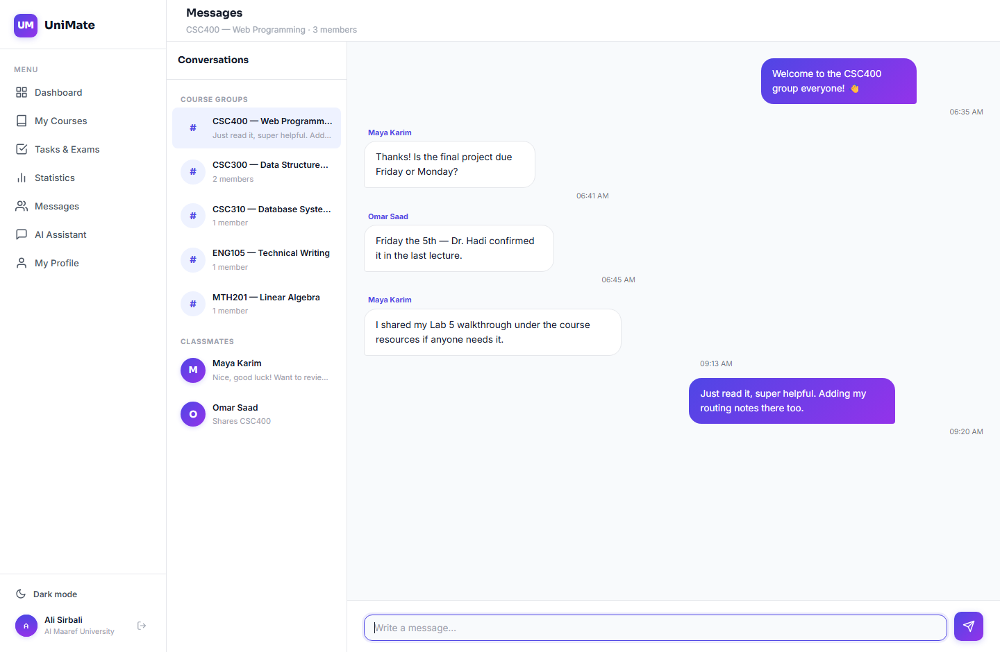

### Shared resources
> Notes, links, and files classmates chose to share for this course.

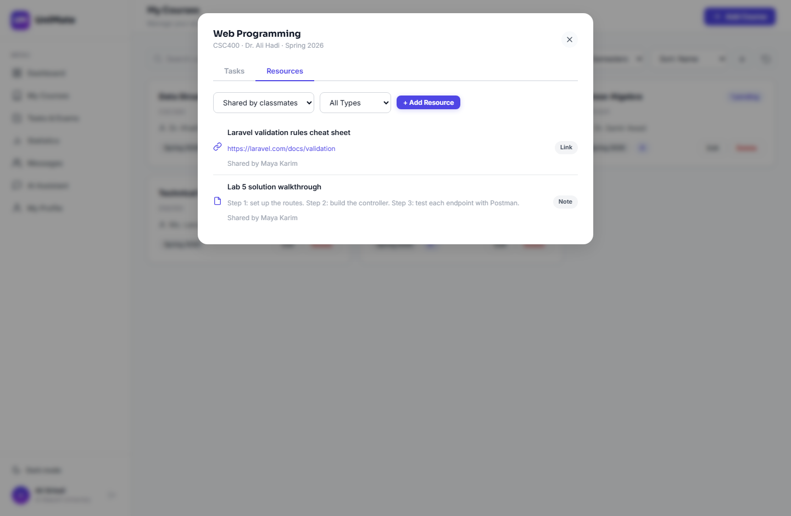

### AI study assistant
> Answers built from your actual courses and deadlines.

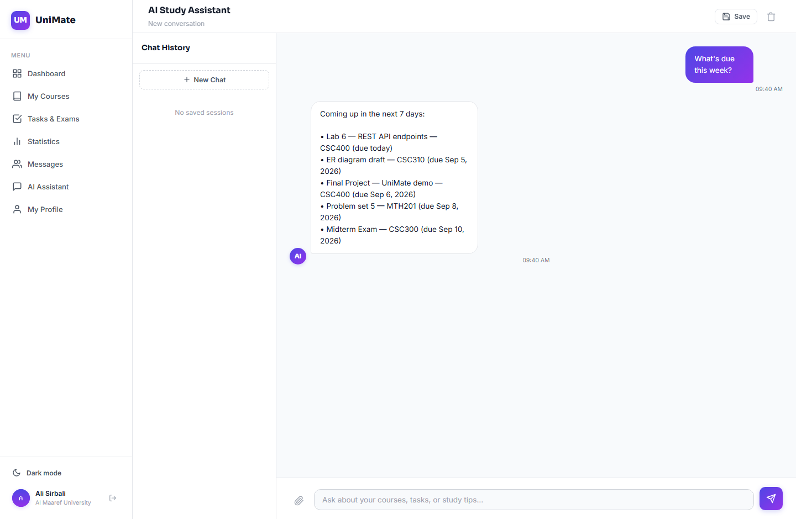

### Statistics & GPA
> Progress by type and by course, with a weighted GPA.

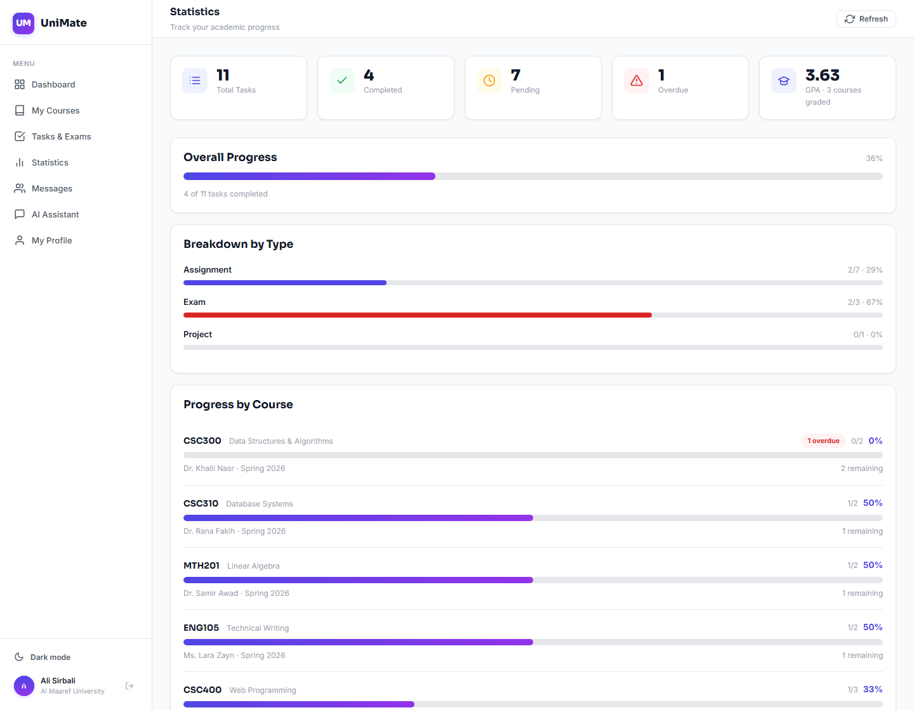

### Profile
> Profile picture upload, account details, and password change.

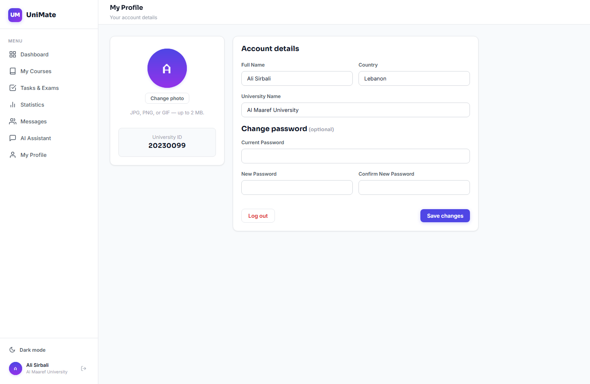

### Dark mode
> The whole interface adapts — one click in the sidebar.

| Dashboard | Courses |
|---|---|
| 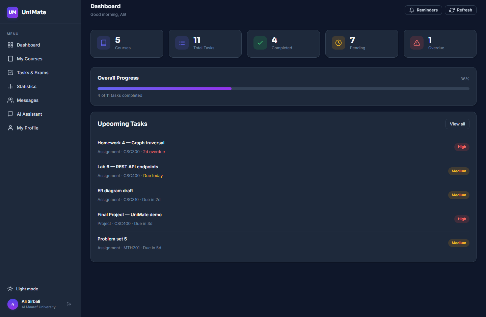 | 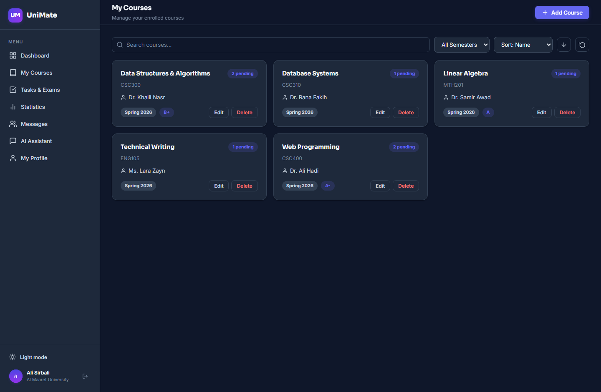 |

### Responsive
> On phones the sidebar and chat panels become slide-in drawers, filters stack,
> and task rows wrap instead of overflowing.

| Dashboard | Tasks | Group chat |
|---|---|---|
| 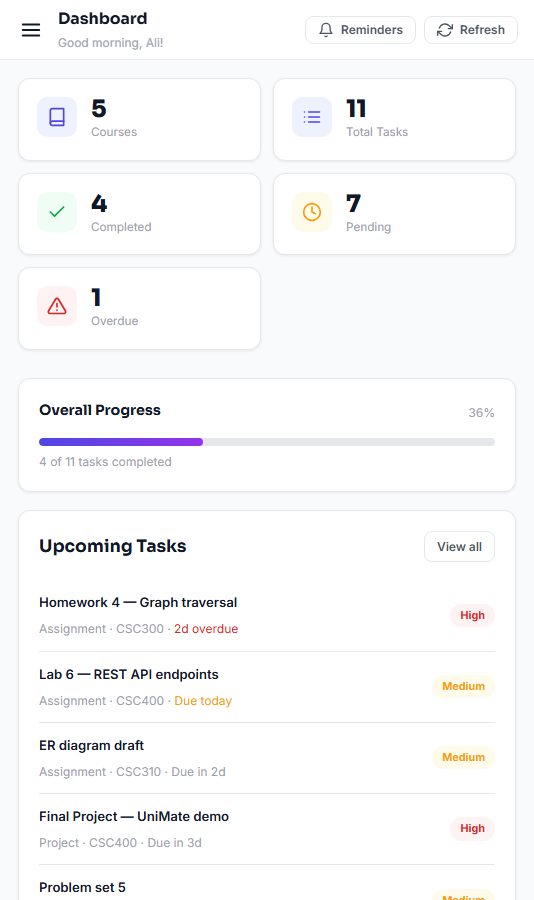 | 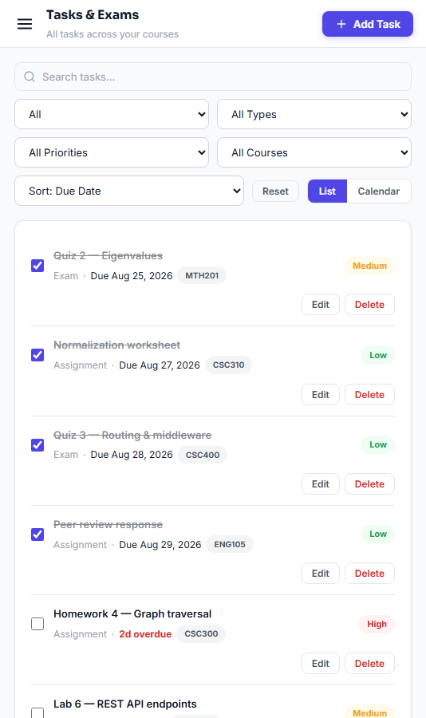 | 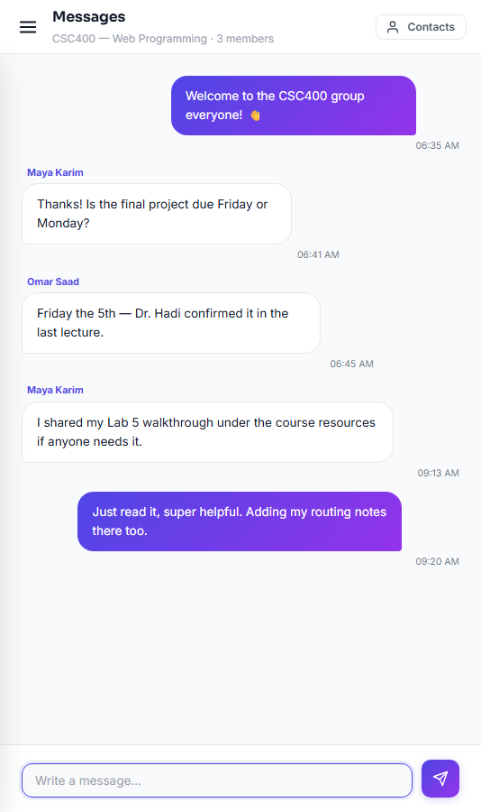 |

---

## Tech stack

| Layer | Technology |
|---|---|
| Backend | Laravel 12, PHP 8.2+ |
| Authentication | Laravel Sanctum (bearer tokens) |
| Database | SQLite by default (MySQL/PostgreSQL supported) |
| Frontend | HTML5, CSS3, vanilla JavaScript (no framework, no build step) |
| Fonts | Sora (headings) + Inter (body), via Google Fonts |
| File storage | Laravel public disk (`storage/app/public`) |

---

## Getting started

**Requirements:** PHP 8.2+, Composer.

```bash
git clone https://github.com/AliHadi315/unimateLaravelFINAAALLLLL.git
cd unimateLaravelFINAAALLLLL
composer install
cp .env.example .env
php artisan key:generate
php artisan migrate
php artisan storage:link
php artisan serve
```

Open <http://localhost:8000> and create an account.

Notes:

- SQLite is the default, so **no database server is required** — `migrate`
  creates `database/database.sqlite` for you.
- `storage:link` is required for profile pictures and file uploads to be served.

---

## Optional: demo data

To explore the app with a populated account — five courses, eleven tasks,
shared resources, and an active group chat — run:

```bash
php artisan db:seed --class=DemoSeeder
```

This creates three students at *Al Maaref University* (all with the password
`test1234`):

| University ID | Name | Courses |
|---|---|---|
| `20230099` | Ali Sirbali | CSC400, CSC300, CSC310, MTH201, ENG105 |
| `20230150` | Maya Karim | CSC400, CSC300 |
| `20230188` | Omar Saad | CSC400 |

Log in as two of them in separate browsers to see messaging and shared
resources working between accounts.

> ⚠️ The seeder clears existing courses, tasks, resources, and messages —
> use it on a development database only.

---

## Optional: connect a real AI model

The study assistant answers questions about your tasks and deadlines offline,
with no configuration. To have a real language model answer instead, add an API
key and model ID from your AI provider to `.env`:

```env
ANTHROPIC_API_KEY=your-api-key
ANTHROPIC_MODEL=your-model-id
```

The backend sends the model a summary of your courses and tasks so its answers
stay grounded in your real data. When the key or model is missing — or the API
call fails — the assistant transparently falls back to the built-in responses,
so the app never breaks in a demo.

---

## Project structure

```
app/
  Http/Controllers/Api/    Auth, Course, Task, Resource, Message,
                           GroupChat, Profile, Upload, AiChat, ChatSession
  Http/Requests/           Form-request validation
  Models/                  User, Course, Task, Resource, Message,
                           GroupMessage, ChatSession
database/
  migrations/              Schema
  seeders/DemoSeeder.php   Optional sample data
public/
  index.html               Landing page
  pages/                   dashboard, courses, tasks, statistics,
                           messages, ai, profile, login, register
  js/                      One file per page + shared api.js / app.js / sidebar.js
  css/style.css            The entire design system
routes/
  api.php                  JSON API
  web.php                  Serves the HTML pages on clean URLs
docs/screenshots/          Images used in this README
```

**How the frontend is organised:** `api.js` wraps every endpoint and attaches
the auth token, `app.js` holds shared helpers (toasts, modals, dates, theme,
uploads), `sidebar.js` renders the navigation, and each page has one script of
its own. Pages are served on clean URLs (`/dashboard`, not
`/pages/dashboard.html`).

---

## API reference

All endpoints are prefixed with `/api`. Everything except register and login
requires a `Authorization: Bearer <token>` header.

### Authentication & profile

| Method | Endpoint | Description |
|---|---|---|
| `POST` | `/auth/register` | Create an account, returns a token |
| `POST` | `/auth/login` | Log in with university ID + password |
| `POST` | `/auth/logout` | Revoke the current token |
| `GET` | `/auth/me` | Current user |
| `PUT` | `/auth/profile` | Update details / change password |
| `POST` | `/auth/avatar` | Upload a profile picture |

### Courses, tasks & resources

| Method | Endpoint | Description |
|---|---|---|
| `GET · POST` | `/courses` | List / create courses |
| `PUT · DELETE` | `/courses/{id}` | Update / delete a course |
| `GET · POST` | `/tasks` | List / create tasks |
| `PUT · DELETE` | `/tasks/{id}` | Update / delete a task |
| `PATCH` | `/tasks/{id}/toggle` | Toggle completion |
| `GET · POST` | `/resources` | List / create resources |
| `PUT · DELETE` | `/resources/{id}` | Update / delete a resource |
| `GET` | `/shared-resources?course_id=` | Resources shared by classmates |
| `POST` | `/uploads` | Upload a file (10 MB max) |

### Messaging & assistant

| Method | Endpoint | Description |
|---|---|---|
| `GET` | `/chat/contacts` | Classmates who share a course with you |
| `GET · POST` | `/chat/messages/{user}` | Read / send direct messages |
| `GET` | `/groups` | Your course group rooms |
| `GET · POST` | `/groups/{code}/messages` | Read / send group messages |
| `GET` | `/ai/status` | Whether a real AI model is configured |
| `POST` | `/ai/chat` | Ask the study assistant |
| `GET · POST` | `/chat-sessions` | Saved assistant conversations |

---

## Database schema

| Table | Purpose |
|---|---|
| `users` | Students — university ID, name, university, country, avatar |
| `courses` | Per-user courses, with optional grade and credits |
| `tasks` | Assignments/exams/projects with due date, priority, attachment |
| `resources` | Notes, links, and files per course, with a `is_shared` flag |
| `messages` | Direct messages between two students |
| `group_messages` | Course-room messages, keyed by course code + university |
| `group_reads` | Per-user "last read" marker, used for unread counts |
| `chat_sessions` | Saved AI assistant conversations (JSON) |

Every record is scoped to its owner, and every endpoint verifies ownership
before returning or modifying data. Classmate visibility is derived — two
students are classmates when they attend the **same university** and have a
course with the **same code**.

---

## Deployment

Checklist for putting UniMate online:

1. **Environment** — set `APP_ENV=production`, `APP_DEBUG=false`, and a real
   `APP_URL` in `.env`.
2. **Install & build**
   ```bash
   composer install --no-dev --optimize-autoloader
   php artisan migrate --force
   php artisan storage:link
   php artisan config:cache && php artisan route:cache
   ```
3. **Web root** — point the domain at the `public/` directory, never the
   project root.
4. **Permissions** — `storage/` and `bootstrap/cache/` must be writable.
5. **Database** — SQLite is fine for a demo; for MySQL/PostgreSQL just change
   the `DB_*` variables, the migrations work unchanged.
6. **Uploads** — on hosts with ephemeral disks (some free tiers), uploaded
   files are wiped on redeploy. Attach a persistent volume or switch
   `FILESYSTEM_DISK` to S3.
7. **Secrets** — set the AI key as a server environment variable; never commit
   `.env`.

Hosts that work well: Laravel Cloud, Laravel Forge with any VPS, Railway,
Render, or classic cPanel shared hosting.

---

## Possible future work

- Real-time messaging over WebSockets (Laravel Reverb) instead of polling
- A weekly timetable view with lecture times and rooms
- Exporting deadlines to Google Calendar (iCal feed)
- Subtasks and checklists inside large projects
- Generating a task list automatically from an uploaded syllabus

---

## Author

**Ali Sirbali** — CSC 400 Web Programming, Al Maaref University.
